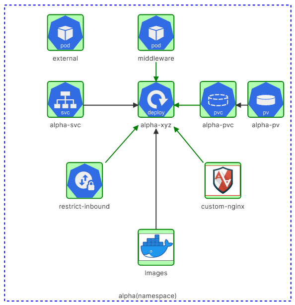

# CKS-challenges
Lab- Challenge 1  

https://kodekloud.com/courses/cks-challenges/



1/  
```
alias k=kubectl
complete -o default -F __start_kubectl k
```
2/  
```
trivy image --severity CRITICAL nginx:alpine |head -n10

2024-05-05T16:40:48.136Z        WARN    This OS version is not on the EOL list: alpine 3.19
2024-05-05T16:40:48.136Z        INFO    Detecting Alpine vulnerabilities...
2024-05-05T16:40:48.137Z        INFO    Trivy skips scanning programming language libraries because no supported file was detected
2024-05-05T16:40:48.137Z        WARN    This OS version is no longer supported by the distribution: alpine 3.19.1
2024-05-05T16:40:48.137Z        WARN    The vulnerability detection may be insufficient because security updates are not provided

nginx:alpine (alpine 3.19.1)
============================
Total: 0 (CRITICAL: 0)
```
3/ PV/PVC
```
k describe pv alpha-pv -n alpha
Name:              alpha-pv
Labels:            <none>
Annotations:       <none>
Finalizers:        [kubernetes.io/pv-protection]
StorageClass:      local-storage
Status:            Available
Claim:             
Reclaim Policy:    Delete
Access Modes:      RWX
VolumeMode:        Filesystem
Capacity:          1Gi
Node Affinity:     
  Required Terms:  
    Term 0:        kubernetes.io/hostname in [controlplane]
Message:           
Source:
    Type:  LocalVolume (a persistent volume backed by local storage on a node)
    Path:  /data/pages
Events:    <none>
```
```
k delete pvc alpha-pvc -n alpha
persistentvolumeclaim "alpha-pvc" deleted
```
```
vim pvc.yml

apiVersion: v1
kind: PersistentVolumeClaim
metadata:
  name: alpha-pvc
  namespace: alpha
spec:
  storageClassName: local-storage
  accessModes:
  - ReadWriteMany
  resources:
    requests:
      storage: 1Gi
      
k create -f pvc.yml
```
4/ APPARMOR
```
mv /root/usr.sbin.nginx /etc/apparmor.d/usr.sbin.nginx
systemctl restart apparmor.service
aa-status |grep custom-nginx
   custom-nginx
```
5/ DEPLOYMENT
```
vim /root/alpha-xyz.yaml

apiVersion: apps/v1
kind: Deployment
metadata:
  creationTimestamp: null
  labels:
    app: alpha-xyz
  name: alpha-xyz
  namespace: alpha
spec:
  replicas: 1
  selector:
    matchLabels:
      app: alpha-xyz
  strategy: {}
  template:
    metadata:
      annotations:
        container.apparmor.security.beta.kubernetes.io/nginx: localhost/custom-nginx <========
      creationTimestamp: null
      labels:
        app: alpha-xyz
    spec:
      volumes:
      - name: data-volume
        persistentVolumeClaim:
          claimName: alpha-pvc
      containers:
      - image: nginx:alpine
        name: nginx
        volumeMounts:
        - name: data-volume
          mountPath: /usr/share/nginx/html
          
k create -f /root/alpha-xyz.yaml
```
6/ SVC
```
k expose deploy alpha-xyz --name=alpha-svc --port=80 --target-port=80 -n alpha


root@controlplane ~ ➜  k get ep -n alpha
NAME        ENDPOINTS      AGE
alpha-svc   10.50.0.6:80   30s
```
7/ NETPOL
```
vim netpol.yml

apiVersion: networking.k8s.io/v1
kind: NetworkPolicy
metadata:
  name: restrict-inbound
  namespace: alpha
spec:
  podSelector:
    matchLabels:
      app: alpha-xyz
  policyTypes:
  - Ingress
  ingress:
  - from:
    - podSelector:
        matchLabels:
          app: middleware
    ports:
    - protocol: TCP
      port: 80
      
k create -f netpol.yml
```   
